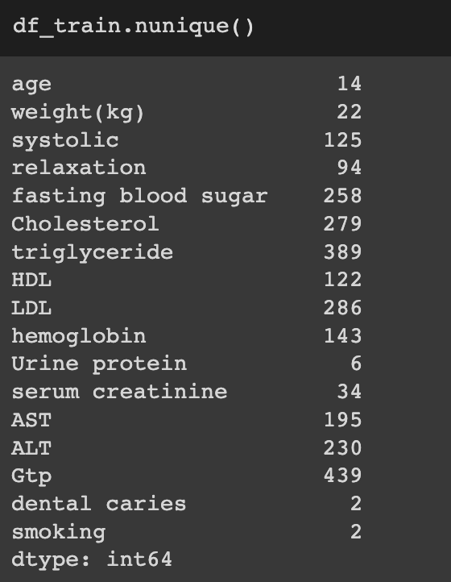
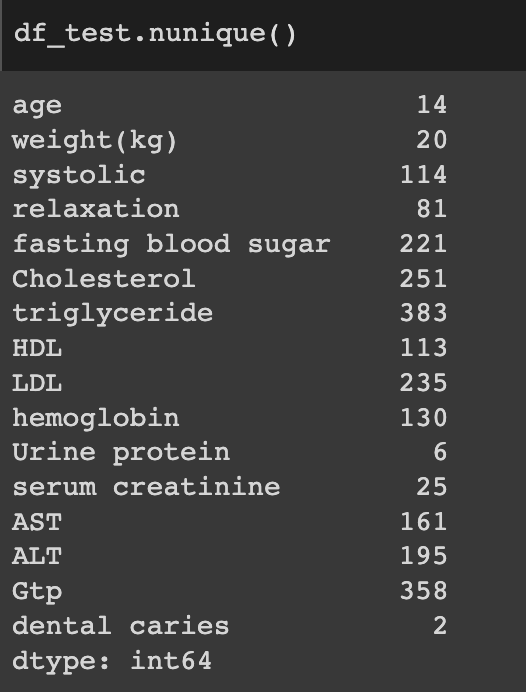

# FinalProject
## Collaborators
- Karl Winterling - https://github.com/kwinterling
- Meri Medel - https://github.com/memusic1523
- Kathryn Bottenberg https://github.com/KathrynBottenberg
- Zev Bennett - https://github.com/zevbennett
    Roles: cleaned data
- Kellen Finn - https://github.com/kelmo974
- Jyotsna Muppasani - https://github.com/JyotsnaMuppasani

## Questions
1. Can we predict a smoker based on certain variables? 
2. What are the top variables which attribute to a smoker vs non smoker? 
3. What health problems may be a factor from smoking?

## Dataset Sources
Smoker status prediction: [Smoker Status Prediction | Kaggle](https://www.kaggle.com/datasets/gauravduttakiit/smoker-status-prediction)

## Software
- Google Colab/ Jupyter Notebook
- Tableau
- SQLite
- Slack
- Github

## Data Details
- from kaggle
- two data sets 
    - test_dataset.csv
        - 38,984 rows
        - 70.0 % of the dataset
        - no null values
        - dtypes in correct format
        - 23 columns: Age, height(cm), weight(kg), waist(cm), eyesight(left), eyesight(right), hearing(left), hearing(right), Systolicre, laxation fasting blood sugar, Cholesterol, Triglyceride, High-Density Lipoprotein (HDL), Low-Density Lipoprotein (LDL), hemoglobin, Urine protein, serum creatinine, Aspartate, Transferase Blood Test (AST), Alanine Transaminase Blood Test (ALT), Gtp, dental caries, Smoking    
        

    - train_dataset.csv
        - 16,708 rows
        - 30.0 % of the dataset
        - no null values
        - dtypes in correct format
        - 22 columns: Age, height(cm), weight(kg), waist(cm), eyesight(left), eyesight(right), hearing(left), hearing(right), Systolicre, laxation fasting blood sugar, Cholesterol, Triglyceride, High-Density Lipoprotein (HDL), Low-Density Lipoprotein (LDL), hemoglobin, Urine protein, serum creatinine, Aspartate, Transferase Blood Test (AST), Alanine Transaminase Blood Test (ALT), Gtp, dental caries    
        
    
## A description of the data exploration phase of the project

## A description of the analysis phase of the project
- Why did you choose this model?
- How will you train the model?
- What’s the accuracy of the model?
- How does the model work?
- If statistics are involved, which ones will the analysis include, and why?
- What would you include or change if you had more time?

## Project Setbacks/Lessons
- Intial dataset we wanted to use [COVID19-Dataset-with-100-World-Countries](https://www.kaggle.com/datasets/sambelkacem/covid19-algeria-and-world-dataset) would not work for machine learning because it had too many variables with repeating values (ie. the population variable would not change, even though it is a continuous vaule and deaths should attribute to it). What we learned is the exploritory process of the data, and knowing what models you plan to use with it, are an essential beginning part of the process. 

