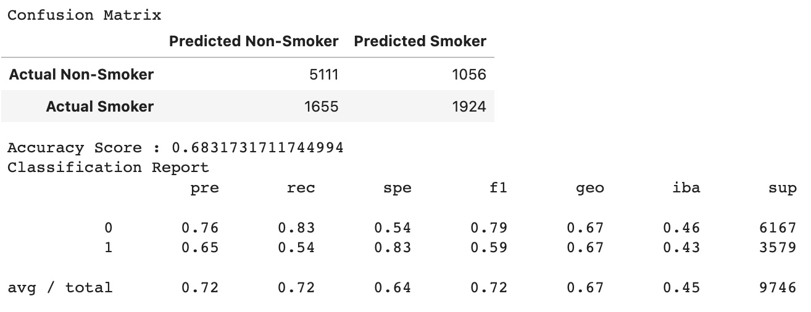
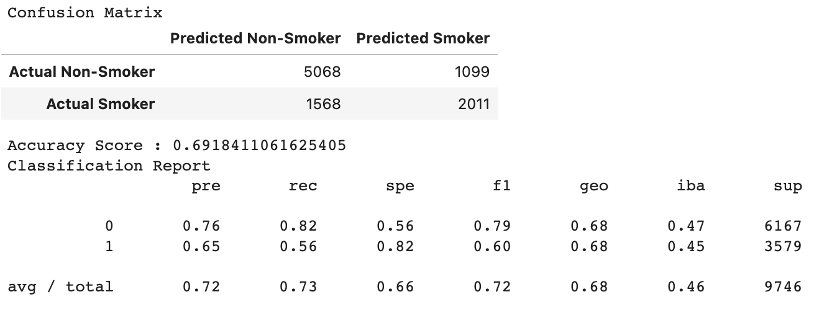
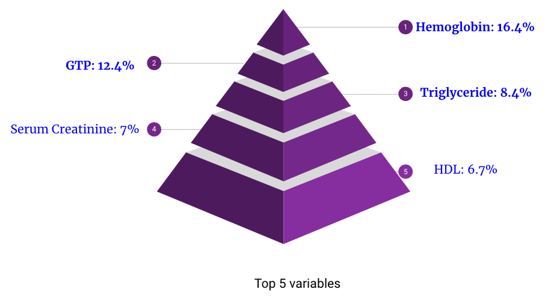

# FinalProject
## Collaborators
- Karl Winterling - https://github.com/kwinterling Roles: Machine Learning Modeling
- Meri Medel - https://github.com/memusic1523 Roles: Visualization
- Kathryn Bottenberg https://github.com/KathrynBottenberg Roles: Facilitator, Machine Learning Modeling
- Zev Bennett - https://github.com/zevbennett Roles: Data Cleaning, Research
- Kellen Finn - https://github.com/kelmo974 Roles: Database Management
- Jyotsna Muppasani - https://github.com/JyotsnaMuppasani Roles: Machine Learning Modeling

## Questions
1. Can we predict a smoker based on certain variables? 
2. What are the top variables which attribute to a smoker vs non smoker? 
3. What health problems may be a factor from smoking?

## Dataset Sources
Smoker status prediction: [Smoker Status Prediction | Kaggle](https://www.kaggle.com/datasets/gauravduttakiit/smoker-status-prediction)

## Software
- Google Colab/ Jupyter Notebook
- Tableau
- SQLite
- Slack
- Github

## Data Details
- from kaggle
- two data sets 
    - test_dataset.csv
        - 38,984 rows
        - 70.0 % of the dataset
        - no null values
        - dtypes in correct format
        - 23 columns: Age, height(cm), weight(kg), waist(cm), eyesight(left), eyesight(right), hearing(left), hearing(right), Systolicre, laxation fasting blood sugar, Cholesterol, Triglyceride, High-Density Lipoprotein (HDL), Low-Density Lipoprotein (LDL), hemoglobin, Urine protein, serum creatinine, Aspartate, Transferase Blood Test (AST), Alanine Transaminase Blood Test (ALT), Gtp, dental caries, Smoking    
        

    - train_dataset.csv
        - 16,708 rows
        - 30.0 % of the dataset
        - no null values
        - dtypes in correct format
        - 22 columns: Age, height(cm), weight(kg), waist(cm), eyesight(left), eyesight(right), hearing(left), hearing(right), Systolicre, laxation fasting blood sugar, Cholesterol, Triglyceride, High-Density Lipoprotein (HDL), Low-Density Lipoprotein (LDL), hemoglobin, Urine protein, serum creatinine, Aspartate, Transferase Blood Test (AST), Alanine Transaminase Blood Test (ALT), Gtp, dental caries    
        
    
## A description of the data exploration phase of the project

## Database Creation
Many datasets were reviewed in the hopes of locating information that could tell a story about the overall health of smokers versus non-smokers. The robust set of quantitative data found in the Smokers Status Prediction dataset posted to Kaggle by Guarav Dutta offers the potential for the use of various machine learning algorithms to train and classify the data. Identifying which health markers contribute the most to a smoker's overall health and/or lifespan will be the desired outcome of this effort. 

After sourcing from Kaggle, the dataset underwent an inital cleaning and was then ready for import into a database. It was decided that the generic patient data, such as height and weight measurements, would be split into a table of their own. Data for the machine learning approach was to be held separately, but linked to to an individual's measurements via an ID number designated as the primary key.

The below image illustrates the connection between the two tables and offers insight to the datatype and formatting. This information would be useful in an attempt to query this data.

Below, a basic filtered query of the dataset can be seen. All rows were successfully uploaded and datatypes conform to dataset structure.

        
      
## Supervised ML:
Initially, we as a team had decided to remove certain variables from our training data and were only using the training dataset for our ML models because we weren't sure how to utilize the testing data along with it, since we did not know the outcomes for that set. The variables we removed from the were: height, weight, waist,eyesight (left and right), and hearing (left and right).
### Linear Regression

### SVM Model

### Naive Random Oversampling:

### SMOTE Oversampling:

### Undersampling:

### Combination (Over and Under) Sampling:
_Sampling.png)

### Easy Ensemble AdaBoost Classifier:

### Balanced Random Forest Classifier:

* Accuracy of around 79%, precision of 80% and recall of 77% is achieved by using Balanced Random Forest Classifier. Hence Balanced Random Forest Classifier is best suited method for our ML model. 

Later in the Project, we decided to try our best model (Balanced Random Forest) with all variables in an attempt to optimize our model, but we were still only using the training dataset, leaving the testing data unused. 

## Optimizing the Balanced Random Forest Classifier:

***Optimizing the Balanced Random Forest Classifier led to having Accuracy of around 80%, precision of 81%, recall of 78% and specificity of 82%. Hence with Balanced Random Forest Classifier our ML model is able to predict with 80% accuracy.***

## Optimizing using the testing_data.csv and training_data.csv
-------------WE NEED IMAGES AND A STORY HERE--------------------

## Presentation Slides
[Google Slide Presentation of Smokers Analysis](https://docs.google.com/presentation/d/1J269H3gS8qX-RNoHSV9GkMj8ZjqVQy4Mau5pxhPjKhQ/edit)

## Visualizations
[Tableau Public Visualization Dashboard](https://public.tableau.com/app/profile/meri.c.medel/viz/Dashboard-Smoking/db-factorsofsmokervsnon-smokers) ([Alternate Link](https://public.tableau.com/views/SmokervsNonSmokervis_Dashboard/db-factorsofsmokervsnon-smokers?:language=en-US&:display_count=n&:origin=viz_share_link))

[Tableau Public Visualization Story](https://public.tableau.com/views/Story-Smokersvs_NonSmokers/Story1?:language=en-US&publish=yes&:display_count=n&:origin=viz_share_link)

## Project Setbacks/Lessons
- Intial dataset we wanted to use [COVID19-Dataset-with-100-World-Countries](https://www.kaggle.com/datasets/sambelkacem/covid19-algeria-and-world-dataset) would not work for machine learning because it had too many variables with repeating values (ie. the population variable would not change, even though it is a continuous vaule and deaths should attribute to it). What we learned is the exploritory process of the data, and knowing what models you plan to use with it, are an essential beginning part of the process. 

## Things to Consider Next Time

- Pick a dataset where we have more information about where the data came from.
    - Found interesting results like height and weight being a important factor.
- Pick a dataset that is more reflective of the general population.
    - Our dataset was ⅓ 40-44 year olds, which is not reflected of the general population
    
## Next Steps

- Optimize Neural Network
    - Challenges: Many unique values in each column, need to bin for many columns

- Use Case: company selling quit smoking programs 

## Summary
### Can we predict a smoker based on certain variables? 
- Can differentiate smokers and non-smokers - 95% accuracy
- Can predict smokers through our model.

### What are the top variables which attribute to a smoker vs non smoker? 

### What health problems may be a factor from smoking?
- ***Hemoglobin Counts:*** An increase in counts has been shown to be a result of smoking.
 
- ***GTP Levels:*** An indicator of Atherosclerosis (Artery disease) can be caused by smoking.
- ***Triglyceride Levels:*** Triglyceride levels are higher in smoking populations than in non-smoking ones.
